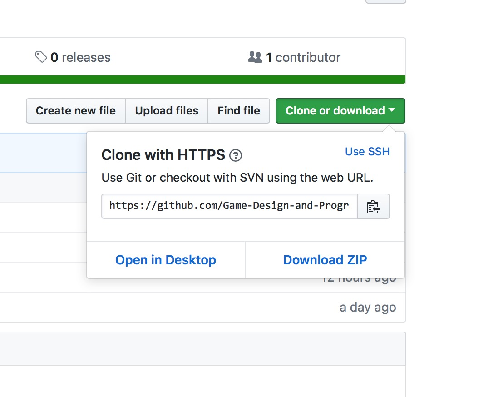
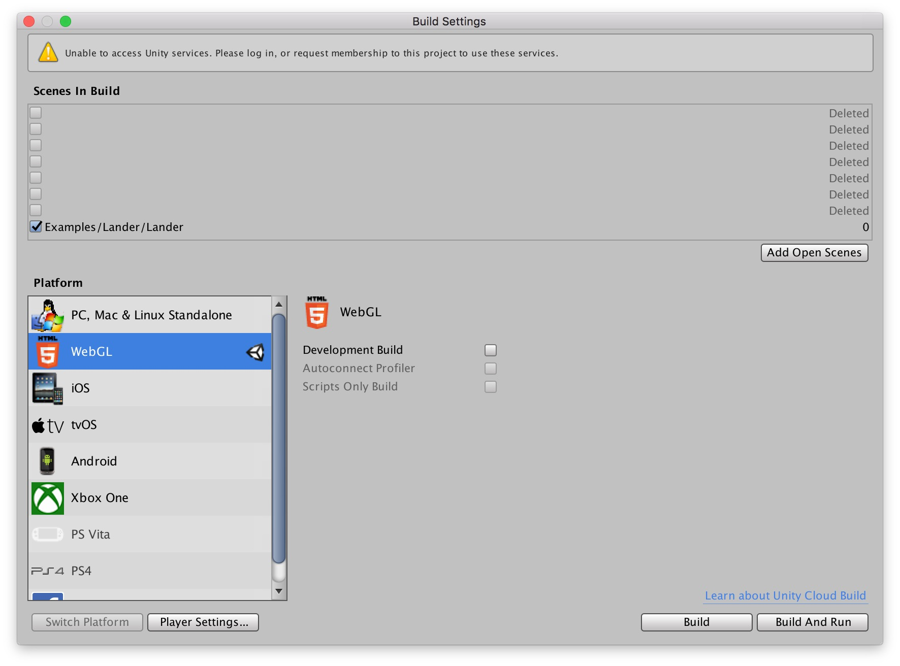

## Overview

In this assignment you will:

* Make a fork of the [PlaygroundProjectStarter][pps] repository on GitHub so that you have your own copy of the code.
* Use Git to _clone_ the repository to your computer.
* Configure Unity to build a WebGL version of one of the example games.
* Build the game.
* Add it to your GitHub Pages website.
* Push your game to GitHub to publish it on your website.

[pps]: <https://github.com/Game-Design-and-Programming-Template/PlaygroundProjectStarter>
[dlu]: <https://douglasurner.github.io>

## Before starting

Make sure that you have:

* Created your GitHub account, and
* Have **verified your e-mail address**. You will not be able to complete this assignment until you have a verified e-mail address.

## Working on the command line

Git Bash is a Windows version of the Unix shell (command interperter) Bash – it is very similar to the Windows command prompt, the biggest difference that you are likely to notice is that the path seperator is the forward slash (/) instead of the backslash (\\).

## Publishing your first game

We'll work through this togething in class for the first time, but you may want to make notes or come back here to review the steps

### 1: Forking the repository on GitHub

On GitHub a _[fork][]_ is a copy of another repository. We'll need to make a fork of the [PlaygroundProjectStarter][pps] code so that you can modify it and keep track of your changes. Here's what to do:

1. **Follow this link to the master [PlaygroundProjectStarter][pps] repository.**
1. Look for the **Fork button** in the upper right hand corner of the browser window.
1. Click on the button to create your own copy of the [PlaygroundProjectStarter][pps] code.

[fork]: <https://guides.github.com/activities/forking/>

### 2: Cloning the repository to your local computer

> Currently (Spring 2018) we do not have authenicated HTTPS access to GitHub. To work around that we can tell Git not to check certificates. To do that enter the following command:
```bash
  git config --global http.sslVerify false
```

1. Before leaving the browser: 
  - **Click** on the green **Clone or download** dropdown menu button.
  - Look for the **clipboard icon** on the right side of the repository URL, **click** on it to copy of the URL.
1. Then, on your computer, **find the `Git Bash` command and launch it.**
1. Then, **c**hange **d**irectories to your class folder by typing:

    ```bash
    cd /u/<the name of your game design folder>
    ```
1. Finally, **clone the [PlaygroundProjectStarter][pps] repository.** You can save yourself some typing by pasting the repository URL that you copied in step three.

    ```bash
    git clone https://github.com/Game-Design-and-Programming-Template/PlaygroundProjectStarter.git
    ```

    The clone may take a minute or so to run, you should see output like this:

    ```bash
    Cloning into \'PlaygroundProjectStarter\'...
    remote: Counting objects: 760, done.
    remote: Compressing objects: 100% (383/383), done.
    remote: Total 760 (delta 375), reused 757 (delta 375), pack-reused 0
    Receiving objects: 100% (760/760), 5.49 MiB | 568.00 KiB/s, done.
    Resolving deltas: 100% (375/375), done.
	  Downloading Assets/Documentation/Cheatsheet Images/1 - Movement.jpg
	  Downloading Assets/Documentation/Cheatsheet Images/2 - Movement2.jpg
	  Downloading Assets/Documentation/Cheatsheet Images/3 - Gameplay.jpg
      .
      .
      .
    ```

### 3: Configuring Unity to build a game to deploy on the web

Now, select one of the game examples in the PlaygroundProject that you would like to build and deploy on the web:

1. Launch Unity.
1. In the open dialog, select the folder you just cloned.
1. Let Unity do it's thing (opening the project for the first time will be slow), then
1. Select a game to build.

That should all have been pretty familiar. Now we're going to bulid a web version:

1. Under the Unity File menu choose **Build Settings...** (File > Build Settings...).
1. Below the Scenes box click on the **Add Open Scenes** button.
1. In the **Platform** section choose WebGL (the orange icon with a 5 in the design).
1. Click the **Build & Run** button in the bottom right corner.
1. In the resulting dialog, select a location and name for the game build.
1. Wait, and wait.

  

Once the game has, finally, built it will open in a browser. As it starts up you may see some messages about allowing network connections. It is OK to allow them.

1. Finally check what has changed:

    ```bash
    git status
    ```
1. Then push your changes back to GitHub:
   ```bash
   git add <changed files that you want to commit>
   git commit -m "Build and test for web."
   git push
   ```

### 4: Adding the game to your GitHub Pages wedsite

Now, some practice. We'll make a clone of your GitHub Pages site and add your game to it. You should be able to make the clone.

After making the clone:

1. Move the folder holding the build of your game into your site.
1. Check to see what has changed with 'git status`. The result will look something like this:

    ```bash
    On branch master
    Your branch is up-to-date with 'origin/master'.

    Untracked files:
      (use "git add <file>..." to include in what will be committed)

            prototypes/Lander/

    nothing added to commit but untracked files present (use "git add" to track)
    ```
 1. Add the new files to Git:

     ```bash
     git add <folder holding your game build>
     ```

     You will probably see messages like this:

     ```bash
     warning: LF will be replaced by CRLF in prototypes/Lander/Build/Build.json.
     The file will have its original line endings in your working directory.
     warning: LF will be replaced by CRLF in prototypes/Lander/Build/UnityLoader.js.
     The file will have its original line endings in your working directory.
     warning: LF will be replaced by CRLF in prototypes/Lander/TemplateData/UnityProgress.js.
     The file will have its original line endings in your working directory.
     ```

### 5: Publishing the updated site – and your game

After making the changes, push them to your GitHub Pages repository, then test.
